# Japan Website

This is a website about Japan, created as a project for my web design classes at school ([Zespół Szkół Technicznych im. Waldemara Gostomczyka](https://bis.zst-ostrow.edu.pl/)). It was developed according to the guidelines specified in this [PDF document](./docs/Zadanie%20Projektowe%20-%20klasa%204.pdf). The website is also available on [GitHub Pages](https://trzmlel.github.io/japan-website/).

## Screenshots

### Desktop

|  | 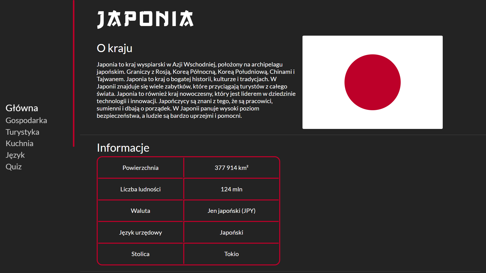 |
|:--------------------------------------------------:|:------------------------------------------------:|
| 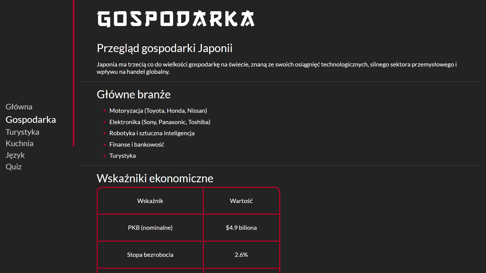 | 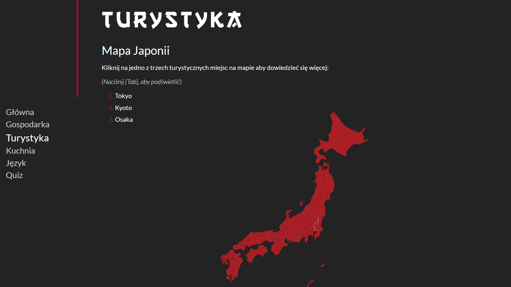 |
| 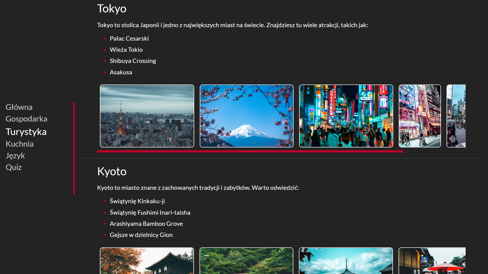 | 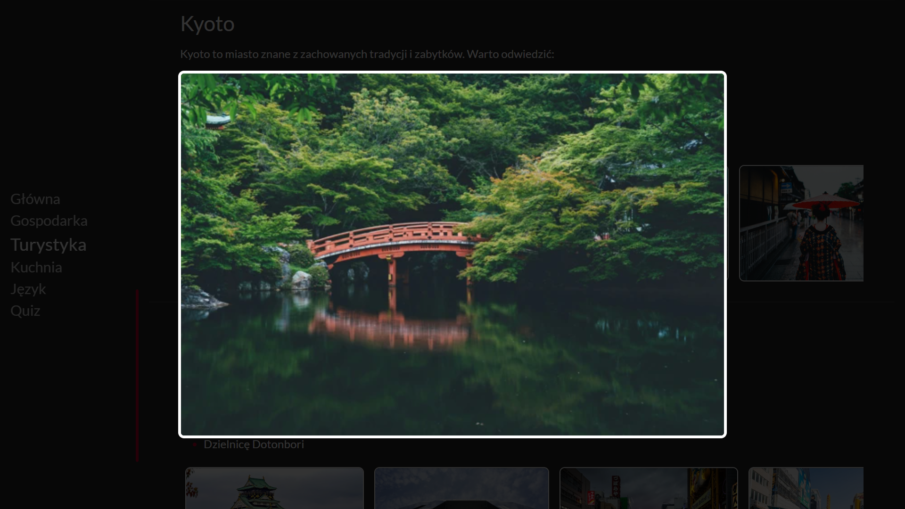 |
| 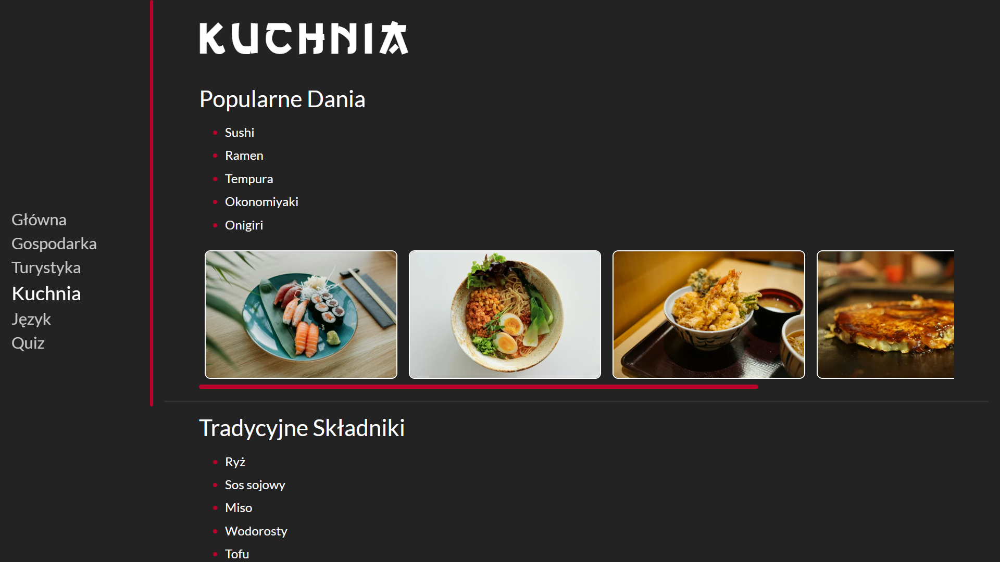 | 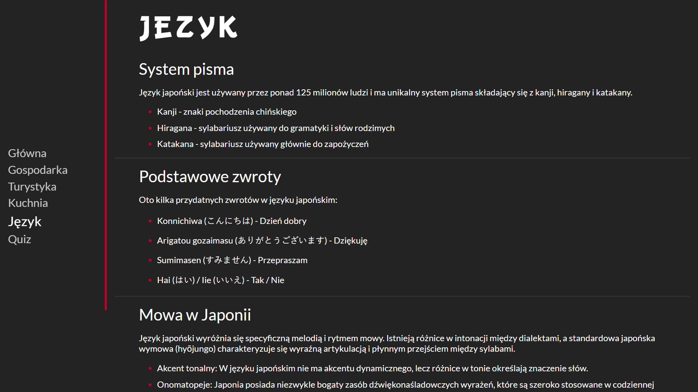 |
| 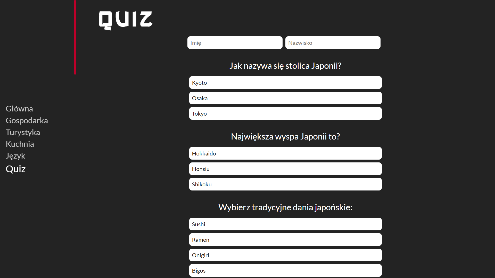 | 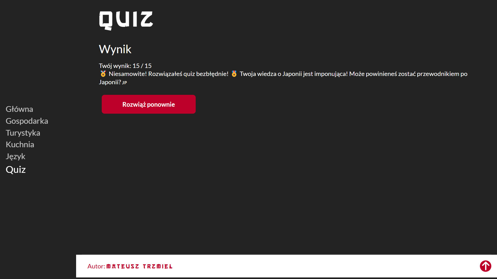 |


### Mobile

|  | 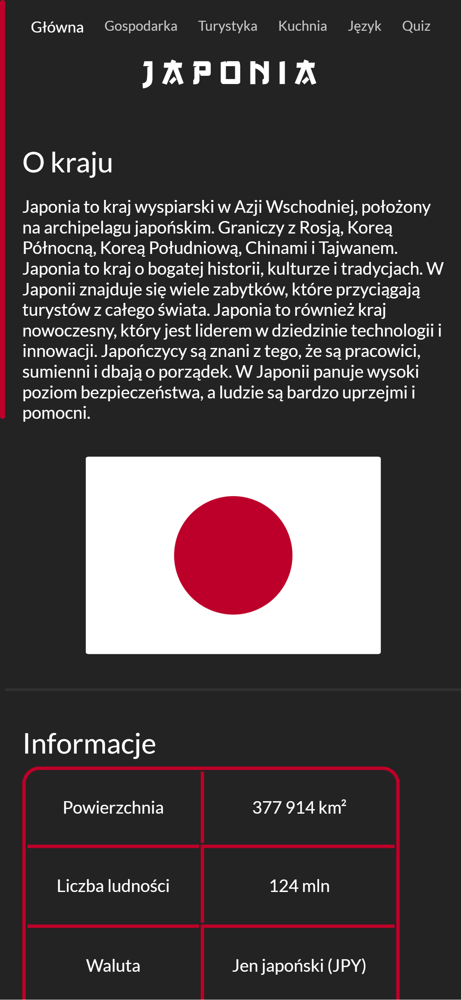 |  |
|:-------------------------------------------------:|:-----------------------------------------------:|:-------------------------------------------------:|
| 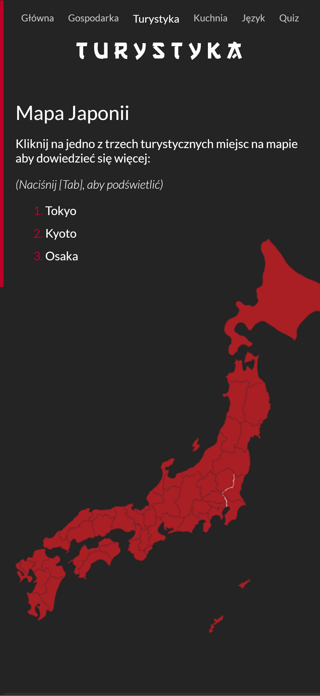 | 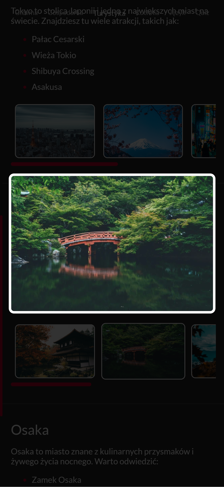 |  |
| 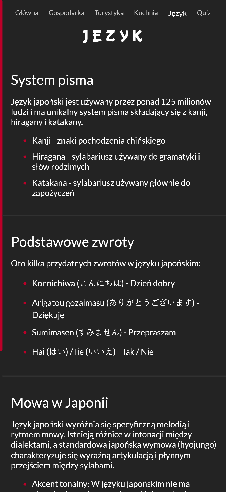 | 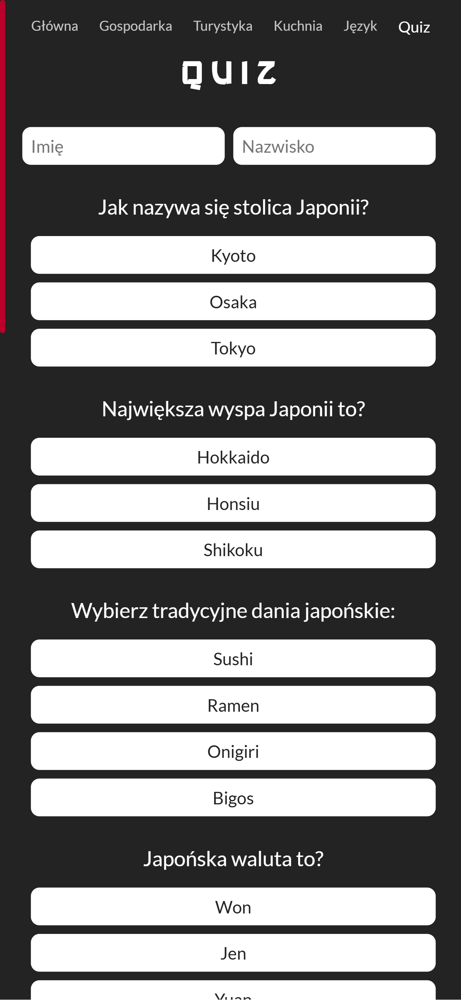 |  |

## Tech Stack

The project was built using only HTML, CSS, and JavaScript.

<p align="left">
  
  
  
</p>

## Cloning the Repository

To clone this repository, use the following command:

```bash
git clone https://github.com/trzmlel/japan-website.git
```

Then, navigate to the project folder:

```bash
cd japan-website
```